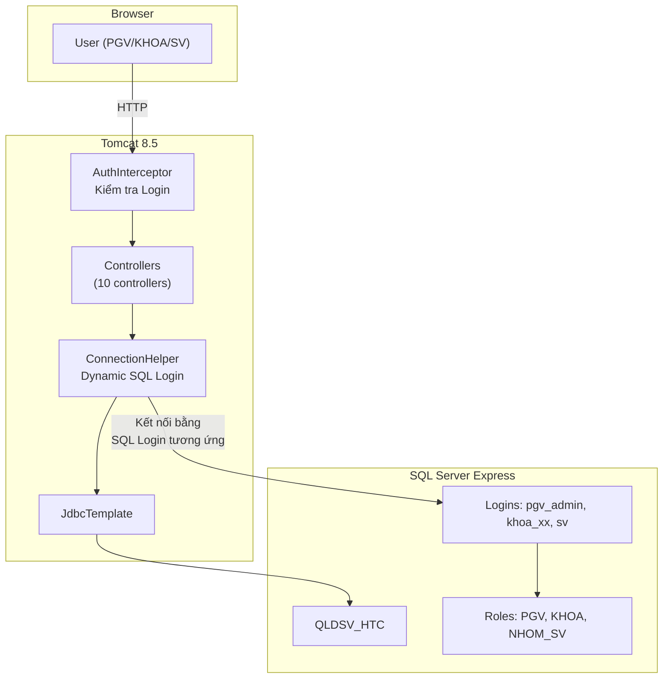

# QLDSV_HTC - Walkthrough & Hướng dẫn Phân quyền SQL Server

## Tổng quan công việc đã hoàn thành

Đã xây dựng hoàn chỉnh hệ thống **Quản lý Điểm Sinh viên Hệ Tín Chỉ** (QLDSV_HTC) bằng Java Spring MVC, gồm:

#### 1. Premium Windows Desktop Theme:
- Thiết kế lại toàn bộ giao diện theo phong cách ứng dụng desktop chuyên nghiệp (Window Titlebar có nút màu Đỏ/Vàng/Xanh, Menu bar, Subbar lọc khoa).
- Sidebar nổi bật chỉ mục đang chọn, thông tin kết nối Cơ sở dữ liệu và đồng hồ hệ thống cập nhật thời gian thực.
- Các lưới hiển thị chia đôi màn hình (Left pane nhập liệu / Right pane danh sách), tạo trải nghiệm sử dụng đồng bộ và cao cấp.

#### 2. Cải tiến và bổ sung tính năng nghiệp vụ:
- **Quản trị tài khoản:** Nâng cấp sang dạng Split Pane (Trái: thông tin tài khoản & hướng dẫn phân quyền / Phải: danh sách tài khoản hiện có trong CSDL). Hỗ trợ nhấp chuột chọn tài khoản từ danh sách để tự động điền form, và xử lý cập nhật tài khoản hệ thống (admin, khoa_cntt, sv) một cách thông minh mà không phụ thuộc vào mã giảng viên.
- **In ấn / Báo cáo:** Hợp nhất 5 mẫu báo cáo vào một màn hình xem trước (Print Preview) trực quan. Người dùng chọn loại báo cáo và nhập tham số ở cột bên trái, dữ liệu báo cáo sẽ được truy vấn và hiển thị dạng bản xem trước chuẩn in ấn (font Times New Roman) ở cột bên phải. Hỗ trợ nút `In trực tiếp` để in nội dung báo cáo mà không cần mở tab mới.
- **Đăng ký Lớp tín chỉ (SV):** Giao diện dạng checklist cho phép check chọn nhiều lớp cùng lúc và nhấn nút "Đăng ký" duy nhất để thực hiện đăng ký/hủy hàng loạt. Hiển thị tổng số lớp đã chọn ở thanh trạng thái thời gian thực.
- **Môn học:** Tự động tính toán trường `Tổng tiết` = `Số tiết LT` + `Số tiết TH` trực tiếp trên form bằng Javascript khi người dùng thay đổi số liệu.
- **Mở Lớp tín chỉ:** Bổ sung thanh cảnh báo ngày chốt hạn niên khóa và tích hợp checkbox `Hủy lớp` đồng bộ trực tiếp vào database.
- **Nhập điểm:** Hỗ trợ nhập bảng điểm học kỳ, tự động tính điểm hết môn theo công thức `CC × 0.1 + GK × 0.3 + CK × 0.6` trực tiếp trên giao diện bằng Javascript ngay khi gõ.
- **Bộ lọc Khoa linh hoạt (PGV):** PGV có thể lọc nhanh danh sách sinh viên, lớp học, giảng viên, lớp tín chỉ theo từng Khoa ở thanh điều hướng phụ (Subbar) hoặc chọn "Tất cả" (mặc định) để xem toàn bộ dữ liệu. Nhờ cơ chế redirect về `Referer`, trang hiện tại sẽ tự động reload ngay lập tức mà không bị nhảy về trang chủ.

---

| Hạng mục | Số lượng | Chi tiết |
|----------|----------|----------|
| Java Controllers | 10 files | Login, Home, Lop, SinhVien, MonHoc, LopTinChi, DangKy, Diem, BaoCao, TaiKhoan |
| Java Utilities | 2 files | ConnectionHelper (dynamic SQL connection), AuthInterceptor |
| JSP Views | 13 files | Login, Home, 6 CRUD forms, BaoCao, Report view, Header, Sidebar |
| Static Resources | 2 files | CSS (style.css), JavaScript (app.js) |
| SQL Scripts | 1 file | setup_security.sql (Logins, Roles, Permissions) |
| Config | 2 files | spring-config-mvc.xml, web.xml |

## File ZIP

📦 **Vị trí:** `C:\Users\phuc\Desktop\hqtcsdl_nhom16_de3.zip` (8.03 MB)

---

## 🔐 HƯỚNG DẪN PHÂN QUYỀN TRONG SQL SERVER

### Bước 1: Mở SQL Server Management Studio (SSMS)

Kết nối vào `localhost\SQLEXPRESS` với tài khoản `sa`.

### Bước 2: Chạy Script phân quyền (Đã chạy tự động)

Script đã được chạy tự động. Nếu cần chạy lại:
```sql
-- Mở file: sql\setup_security.sql
-- Hoặc chạy bằng SSMS: File → Open → chọn file → Execute
```

### Bước 3: Kiểm tra Logins đã tạo

Trong SSMS, mở **Security → Logins**, bạn sẽ thấy 4 logins:

| Login | Password | Ý nghĩa |
|-------|----------|---------|
| `pgv_admin` | `123456` | Phòng Giáo vụ - toàn quyền |
| `khoa_cntt` | `khoa123` | Khoa CNTT - quyền hạn chế |
| `khoa_vt` | `khoa456` | Khoa Viễn Thông - quyền hạn chế |
| `sv` | `sv123` | Sinh viên (dùng chung) - quyền tối thiểu |

### Bước 4: Kiểm tra Database Roles

Trong SSMS: `QLDSV_HTC → Security → Roles → Database Roles`:

| Role | Members | Quyền |
|------|---------|-------|
| **PGV** | pgv_admin | SELECT, INSERT, UPDATE, DELETE trên tất cả bảng |
| **KHOA** | khoa_cntt, khoa_vt | SELECT trên tất cả; UPDATE trên DANGKY (nhập điểm) |
| **NHOM_SV** | sv | SELECT trên các bảng; INSERT, UPDATE trên DANGKY (đăng ký) |

### Bước 5: Kiểm tra Permissions (Xác minh trực quan)

Trong SSMS, click chuột phải vào Role `KHOA` → Properties → Securables:
- ✅ SELECT trên KHOA, LOP, SINHVIEN, MONHOC, GIANGVIEN, LOPTINCHI
- ✅ SELECT, UPDATE trên DANGKY
- ❌ KHÔNG có INSERT/DELETE trên KHOA, LOP, SINHVIEN, MONHOC, GIANGVIEN, LOPTINCHI

> [!TIP]
> Để test quyền thủ công: Trong SSMS, kết nối lại bằng login `khoa_cntt` / `khoa123`, thử chạy:
> ```sql
> USE QLDSV_HTC;
> -- Sẽ thành công (có quyền SELECT):
> SELECT * FROM LOP;
> -- Sẽ thất bại (không có quyền INSERT):
> INSERT INTO LOP VALUES ('TEST', 'Test', '2024-2028', 'CNTT');
> ```

### Bước 6: Stored Procedures & Bảo mật Nâng cao (100% Theo Giảng dạy)

Đã cấu hình các stored procedure bảo mật trong `sql/sp_and_views.sql`:
1. **`sp_ThongTinDangNhap @tenlogin`**:
   - Truy xuất `USERNAME` (Mã giảng viên/sinh viên), `HOTEN` (Họ tên đầy đủ), và `ROLENAME` (Nhóm quyền: `PGV`, `KHOA`, `NHOM_SV`) tương ứng của tài khoản đăng nhập.
   - Hỗ trợ cả tài khoản cá nhân của từng Giảng viên và tài khoản dùng chung của phòng ban.
2. **`sp_TaoTaiKhoan @LGNAME, @PASS, @USERNAME, @ROLE`**:
   - Tạo đồng thời SQL Server Login, Database User cho giảng viên và phân quyền vào Role tương ứng (`PGV` hoặc `KHOA`).
   - Tự động đồng bộ hóa thông tin vào bảng `TaiKhoan` trong database để theo dõi.

---

## 🖥️ CÁC CHỨC NĂNG ĐÃ TRIỂN KHAI

### 3.1. Đăng nhập
- **Giảng viên**: Nhập trực tiếp SQL Login + Password và chọn Nhóm quyền đăng nhập. Hệ thống thử kết nối JDBC bằng tài khoản này. Nếu thành công (xác thực mật khẩu hợp lệ), hệ thống gọi `sp_ThongTinDangNhap` để lấy thông tin cá nhân và Nhóm quyền, đồng thời đối chiếu xác minh nhóm quyền được chọn trên giao diện có khớp với nhóm quyền thực tế của tài khoản trong CSDL hay không.
- **Sinh viên**: Đăng nhập qua tài khoản dùng chung `sv`/`sv123` của SQL Server, sau đó hệ thống kiểm tra Mã sinh viên & mật khẩu của riêng sinh viên đó trong bảng `SINHVIEN`.

### 3.2. Nhập liệu (PGV)
- **Danh mục Lớp**: Form CRUD (Thêm/Xóa/Ghi/Phục hồi/Thoát), lọc theo khoa.
- **Sinh viên**: SubForm 2 cấp (chọn Lớp → xem DS SV).
- **Môn học**: Form CRUD đầy đủ, tự động tính tổng số tiết.
- **Lớp tín chỉ**: Mở/quản lý lớp TC, cảnh báo ngày niên khóa và hủy lớp.
- **Đăng ký LTC** (SV): Chọn học kỳ -> tick chọn đăng ký nhanh nhiều lớp -> Đăng ký.
- **Nhập điểm** (PGV + KHOA): Nhập điểm và tính toán điểm hết môn tự động.

### 3.3. Phân quyền
- **PGV**: Toàn quyền, quản lý tài khoản cho PGV/KHOA.
- **KHOA**: Chỉ nhập điểm khoa mình, xem báo cáo khoa mình.
- **SV**: Đăng ký LTC, xem phiếu điểm bản thân.
- Phân quyền enforce ở **2 tầng**: Application + SQL Server Roles (tất cả các truy vấn thông qua kết nối SQL Server của chính tài khoản người dùng đăng nhập).

### 3.4. Báo cáo (5 loại)
1. **Danh sách lớp tín chỉ theo NK/HK**: Lọc theo Khoa, Niên khóa, Học kỳ.
2. **DS sinh viên đăng ký LTC**: Lọc theo Khoa, Niên khóa, Học kỳ, Môn học, Nhóm.
3. **Bảng điểm hết môn (CC×0.1 + GK×0.3 + CK×0.6)**: Lọc theo Khoa, Niên khóa, Học kỳ, Môn học, Nhóm.
4. **Phiếu điểm SV (điểm max các lần thi)**: Lọc theo Mã sinh viên, Phạm vi (Toàn khóa hoặc theo Học kỳ/Niên khóa).
5. **Bảng điểm tổng kết cuối khóa (Cross-Tab)**: Lọc theo Khoa, Lớp hành chính.

#### 🌟 Cải tiến đặc biệt trong Trung tâm Báo cáo:
- **Dữ liệu lọc động:** Các trường "Niên khóa" và "Học kỳ" được tải động trực tiếp từ cơ sở dữ liệu (thông qua bảng `LOPTINCHI`), loại bỏ hoàn toàn các ô nhập tay hoặc chọn cứng.
- **Phân loại phạm vi:** Hỗ trợ sinh viên và giáo vụ lựa chọn in phiếu điểm "Toàn khóa" hoặc lọc theo "Niên khóa/Học kỳ" linh hoạt.
- **Thống kê chi tiết (Footer):** Phần chân bảng điểm sinh viên được tích hợp card thống kê hiện đại (Tổng số môn, Tổng số tín chỉ tích lũy, Điểm trung bình tích lũy GPA hệ 4, Xếp loại học lực và Trạng thái tốt nghiệp).
- **Chuẩn in ấn chuyên nghiệp (CSS Print):** Cấu hình CSS `@media print` thông minh:
  - Tự động ngắt trang khi số môn học lớn (ví dụ: sinh viên đã tốt nghiệp học 40-60 môn).
  - Tránh ngắt dòng dở dang giữa các hàng (`page-break-inside: avoid`).
  - Lặp lại tiêu đề cột (TableHeader) ở đầu mỗi trang in mới (`display: table-header-group`).
  - Ẩn toàn bộ nút bấm và các thanh điều hướng giao diện web khi in, chỉ giữ lại phần nội dung phiếu điểm chuẩn hóa.

### 3.5. Quản trị
- **Tạo tài khoản mới**: PGV gọi `sp_TaoTaiKhoan` để tự động tạo SQL Server Login, Database User và phân quyền trực tiếp trên Database.
- **Xóa tài khoản**: PGV xóa tài khoản trong bảng `TaiKhoan` đồng thời tự động thực hiện `DROP USER` và `DROP LOGIN` trên SQL Server để đảm bảo an toàn tuyệt đối.

---

## 🚀 HƯỚNG DẪN CHẠY PROJECT

### Cách 1: Trong Eclipse
1. Import project: `File → Import → Existing Projects into Workspace`
2. Chọn thư mục `hqtcsdl_nhom16_de3`
3. Cấu hình Server: `Window → Preferences → Server → Runtime → Apache Tomcat 8.5`
4. Click phải project → `Run As → Run on Server`
5. Truy cập: `http://localhost:9090/hqtcsdl_nhom16_de3/login` (hoặc cổng port tương ứng của Tomcat trên máy của bạn, ví dụ: 9090 hoặc 8080)

### Tài khoản test

| Loại | Login | Password | Mô tả |
|------|-------|----------|-------|
| PGV | `pgv_admin` | `123456` | Toàn quyền |
| KHOA | `khoa_cntt` | `khoa123` | Khoa CNTT |
| KHOA | `khoa_vt` | `khoa456` | Khoa VT |
| SV | Bất kỳ MASV (vd: `N15DCCN001`) | `123456` | Sinh viên |

---

## 📊 KIẾN TRÚC HỆ THỐNG



> [!IMPORTANT]
> **Dynamic SQL Connection**: Khi user đăng nhập, hệ thống tự động chuyển kết nối SQL Server sang login tương ứng (pgv_admin/khoa_cntt/khoa_vt/sv). SQL Server sẽ tự enforce permissions dựa trên Role. Đây là **phân quyền 2 tầng**: Application layer + Database layer.
